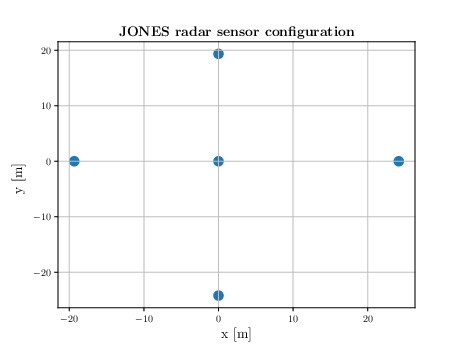
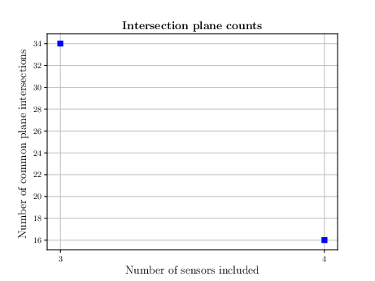
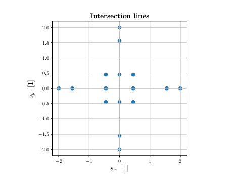
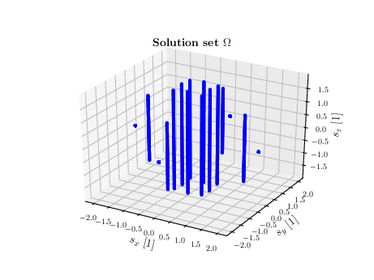
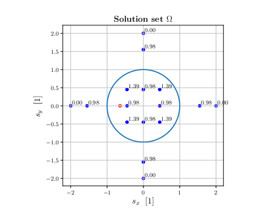
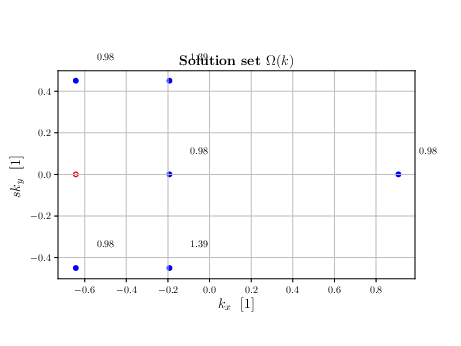

Example of utilization and expected outputs.
============================================

Solve the problem for a certain radar configuration
###################################################

As an example take one of the radar configurations, **JONES** in this case, with a frequency of 31 MHz.

The coordinates of the subarray are

==== ====
x    y
==== ====
0    2
0    -2.5
-2   0
2.5  0
0    0
==== ====

By running a python script with

::

    import os
    import numpy as np
    from functions import *
    from radarconf import radar_conf
    from ambiguity_calculator import ambiguities_calculate
    import itertools
    from scipy.constants import pi as pi
    from time import time, gmtime, strftime
    import h5py

    ambiguities_calculate(radar_name='JONES', frequency=31)

a HDF5 called JONES.h5 containing the calculation results is generated in the folder ../processed_data/JONES.

JONES.h5 contains several items, data sets. Organized between two main HDF5 groups.

* root:

    * trivial_calculations: holds results from calculations which are straight forward and whose results can be used for to track the results.

        * *sensor_groups*
        * *subgroup_phase_center*
        * *linear_coefficients*
        * *base_numbers*
        * *k_length*

    * results_permutations: holds the results of the permutations and ambiguities.

        * *intersections_integers_complete*
        * *ambiguity_distances_INT_FORM_MAT*
        * *ambiguity_distances_INT_FORM_mean*
        * *ambiguity_distances_WAVE_FORM_MAT*
        * *ambiguity_distances_WAVE_FORM*
        * *intersection_line*
        * *survivors*

Use the results to see the ambiguities for a DOA.
##################################################

